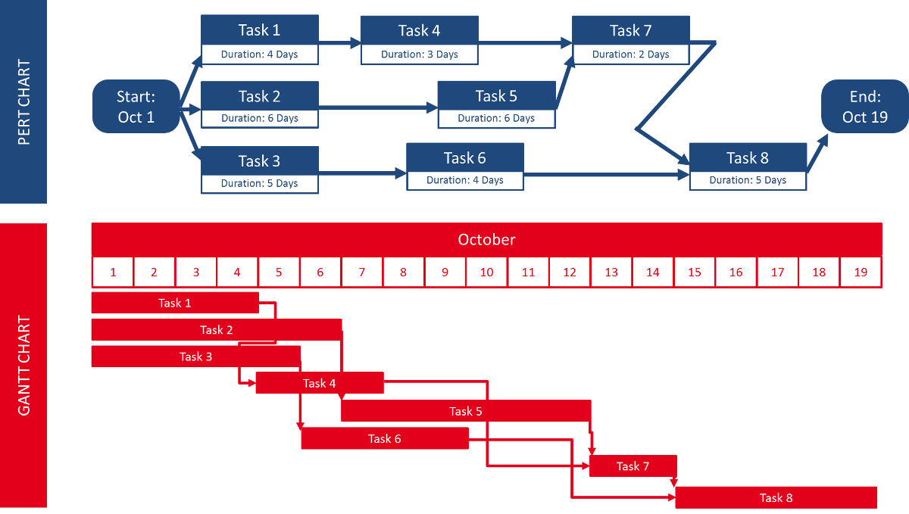

# 정보시스템 구축관리

## 소프트웨어 생명주기 모델
### V 모델
+ 폭포수 모델의 병형
+ 📌 하향식으로 디자인한 뒤, 상향식으로 만드는 방식
+ Perry에 의해 제안되었으며 세부적인 테스트 과정으로 구성되어 신뢰도 높은 시스템을 개발하는데 효과적이다. 
+ 개발 작업과 검증 작업 사이의 관계를 명확히 들어내 놓은 폭포수 모델의 변형이라고 볼 수 있다.
+ 폭포수 모델이 산출물 중심이라면 V 모델은 작업과 결과의 검증에 초점을 둔다.
### 나선형 모델
+ 소프트웨어 개발 프로세스를 위험 관리(Risk Management) 측면에서 본 모델이다. 
+ 📌 위험 분석(Risk Analysis)은 반복적인 개발 진행에서 각 단계에서 여러 번 수행한다.
+ 시스템을 여러 부분으로 나누어 여러 번의 개발 주기를 거치면서 시스템이 완성된다. 
+ 📌 요구사항이나 아키텍처를 이해하기 어렵다거나 중심이 되는 기술에 문제가 있는 경우 적합한 모델이다.

<br><br>
## 소프트웨어 개발 방법론
### 테일러링(Tailoring)
+ 프로젝트에 최적화된 개발 방법론을 적용하기 위해 절차, 산출물 등을 적절히 변경하는 활동이다.     
+ 관리 측면에서의 목적 중 하나는 최단기간에 안정적인 프로젝트 진행을 위한 사전 위험을 식별하고 제거하는 것이다.     
+ 기술적 측면에서의 목적 중 하나는 프로젝트에 최적화된 기술 요소를 도입하여 프로젝트 특성에 맞는 최적의 기법과 도구를 사용하는 것이다.
+ 📌 변화를 배제하는 것은 아니다.

<br><br>
## 정보보안 3요소
> 기밀성, 무결성, 가용성
+ 기밀성(Confidentiality): 인가된 사용자만 정보 자산에 접근할 수 있는 것. 방화벽, 암호, 패스워드 등
+ 무결성(Integrity): 적절한 권한을 가진 사용자가 인가한 방법으로만 정보를 변경할 수 있도록 하는 것.
+ 가용성(Availability): 필요한 시점에 정보 자산에 대한 접근이 가능하도록 하는 것. 백업 등
+ 📌 휘발성은 해당하지 않는다.

<br><br>
## 취약점 관리를 위한 응용 프로그램의 보안 설정
+ 실행 프로세스 권한 설정
+ 운영체제의 접근 제한
+ 운영체제의 정보 수집 제한
+ 무결성 검사
  + 데이터의 정확성, 일관성, 유효성이 유지되는 것
+ 응용 프로그램의 보안 설정 및 패치(Patch) 적용
+ 불필요한 서비스 및 악성 프로그램의 확인과 제거

<br><br>
## 프레임워크
+ 프레임워크의 동작 원리를 그 제어 흐름의 일반적인 프로그램 흐름과 반대로 동작한다고 해서 IoC(Inversion of Control)이라고 설명하기도 한다.
+ 특성: 모듈화, 재사용성, 확장성, 제어의 역흐름
+ Python 웹 크롤링 프레임워크: Scrapy

<br><br>
## 라이브러리
+ 사용자 코드에서 호출해서 사용하고, 그에 대한 제어도 사용자 코드가 가지는 방식

<br><br>
## 클라우드 기반 HSM(Cloud-based Hardware Security Module)
+ 클라우드(데이터센터) 기반 암호화 키 생성, 처리, 저장 등을 하는 보안 기기이다.
+ 국내에서는 공인인증제의 폐지와 전자서명법 개정을 추진하면서 클라우드 HSM 용어가 자주 등장하였다.
+ 클라우드에 인증서를 저장하므로 기존 HSM 기기나 휴대폰에 인증서를 저장해 다닐 필요가 없다.
+ 전용 하드웨어가 전담하기 때문에 소프트웨어 전용 암호 기술에 내재된 보안 취약점을 해결할 수 있다.


<br><br>
## 암호 알고리즘
### 양방향 암호 알고리즘
#### 대칭 암호 알고리즘
+ 비교적 실행 속도가 빠르기 때문에 다양한 암호의 핵심 함수로 사용
+ 교환 당사자간 동일한 키를 공유해야 하며, 키관리에 어려움이 있고, 잦은 키 변경이 있는 경우에 불편함을 초래한다.
+ 📌 키 교환이 필요
+ 📌 블록암호(AES, DES, ARIA, SEED, HIGHT, IDEA)
  + DES: 64비트의 키(외부 키)중에서 56비트는 실제의 키(내부 키)가 되고 나머지는 거사용 비트로 사용된다.
+ 스트림 암호(RC4)
#### 비대칭 암호 알고리즘
+ 공개키, 암호키 존재
+ 자신만이 보관하는 비밀키를 이용하여 인증, 전자서명 등에 적용이 가능
### 단방향 암호 알고리즘
#### MDC
+ 메시지 무결성 보장
+ MD5, SHA-1, SHA-2
+ 대칭키 미사용
#### MCA
+ 메시지 인증
+ 대칭키 사용

<br><br>
## 보안용어
### Worm 
+ 악성코드의 유형 중 다른 컴퓨터의 취약점을 이용하여 스스로 전파하거나 메일로 전파되며 스스로를 증식하는 것
+ 스스로를 복제하는 악성 소프트웨어 프로그램
+ 스턱스넷(Stuxnet)
  + 마이크로소프트 윈도우를 통해 감염되어, 지멘스 산업의 소프트웨어 및 장비를 공격
### Rogue Ware
+ 가짜 백신 소프트웨어
+ 사용자가 컴퓨터에 바이러스가 있다고 잘못 믿게 하고 컴퓨터에 실제로 악성 프로그램을 설치토록 하거나, 가짜 악성 프로그램 제거 도구에 대한 비용을 지불하도록 설득함.
### Adware
+ 특정 소프트웨어를 실행할 때 또는 자동으로 활성화되는 광고 프로그램
+ 무분별한 광고 팝업을 뜨게 하는 등 악용 위험성으로 악성코드로 분류되기도 함
### Reflection Attack
+ 반사공격
+ 송신자가 생성한 메세지를 가로챈 공격자가 그 메시지를 다시 송신자에게 재전송하여 접근 권한을 얻는 형태의 공격방법
### RBAC(Role-Based Access Control)
+ 접근 통제 방법 중 조직 내에서 직무, 직책 등 개인의 역할에 따라 결정하여 부여하는 접근 정책
### tcp wrapper
+ 어떤 외부 컴퓨터가 접속되면 접속 인가 여부를 점검해서 인가된 경우에는 접속이 허용되고, 그 반대의 경우에는 거부할 수 있는 접근제어 유틸리티
+ 시스템 침입 흔적을 조사하는 도구, 해킹당한 시스템 조사
### 루팅(Rooting)
+ 안드로이드폰의 운영체제를 해킹해 관리자의 권한을 얻는 행위를 말하며, 리눅스에서 관리자 권한을 얻는 행위를 지칭하는 용어에서 파생됐다.
### Switch Jamming
+ 스위치의 기능을 마비시키는 공격
+ 위조된 매체 접근 제어(MAC) 주소를 지속적으로 네트워크로 흘려보내, 스위치 MAC 주소 테이블의 저장 기능을 혼란시켜 더미 허브(Dummy Hub)처럼 작동하게 하는 공격
### 📌 블루투스(Bluetooth) 공격
#### 블루스나프(BlueSnarf)
+ 장비의 임의 파일에 접근하는 공격
#### 블루프린팅(BluePrinting)
+ 블루투스 공격 장치의 검색활동을 의미
#### 블루버그(BlueBug)
+ 장비간 취약한 연결 관리를 악용한 공격
#### 블루재킹(BlueJacking)
+ 스팸처럼 명함을 익명으로 퍼트리는 것
### 📌 DoS(Denial of Service) 공격
#### Ping of Death 공격
  + 시스템 공격 기법 중 하나로 허용범위 이상의 ICMP 패킷을 전송하여 대상 시스템의 네트워크를 마비시킨다.
  + 정상 크기보다 큰 ICMP 패킷을 작은 조각(Fragment)으로 쪼개어 공격 대상이 조각화 된 패킷을 처리하게 만드는 공격 방법이다. 
  + 작은 사이즈의 패킷을 재조합하는 과정에서 Buffer overflow 및 시스템 충돌이 발생한다.
#### Smurf 공격
  + 공격자가 ICMP를 조작하여 한번에 많은 양의 ICMP Reply를 공격 대상에게 보내는 공격 공격자가 출발지 주소를 공격할 서버의 IP로 설정하고 네트워크 상에 모든 호스트에게 ```Broadcast```로 ICMP를 보낸다.
  + 수많은 호스트들이 서버에게 ICMP Reply를 보내게 되고 서버는 이를 처리하느라 시스템 과부하 상태가 되게 하는 공격 
  + 브로드캐스트
    + 송신 호스트가 전송한 데이터가 네트워크에 연결된 모든 호스트에 전송되는 방식을 의미한다.
#### SYN Flooding
  + Flooding은 서버에 공격자의 요청 로그를 잔뜩 보내어 다른 이들이 접속하지 못하게 막는 DoS 공격이다.
  + 존재하지 않는 클라이언트가 서버별로 한정된 접속 가능 공간에 접속한 것처럼 속여 다른 사용자가 서비스를 이용하지 못하게 하는 것이다. 
  + FTP Flooding?
#### Land Attack
  + 패킷 전송 시 출발지 IP주소와 목적지 IP주소 값을 똑같이 만들어서 공격 대상에게 보내는 공격 방법이다.
  + 계속 server 내부에서 돌면서 자원이 고갈
### Piggyback Attack
+ 사회공학적 방법으로 몰래 따라들어가 대체로 물리적인 보안 장치들이 많이 존재하는 장치들을 우회하는 방법
### XSS(=CSS, Cross Site Scripting)
+ 공격자가 게시판에 악성 스크립트를 작성, 삽입하여 사용자가 그것을 보았을 때 이벤트 발생으로 사용자의 쿠키 정보, 개인 정보 등을 특정 사이트로 전송하는 공격기법
### Land Attack
+ 패킷 전송시 출발지 IP 주소와 목적기 IP 주솟값을 똑같이 만들어서 공격 대상에게 보내는 공격기법이다.
### CSRF(Cross Site Request Forgery)
+ 사용자가 자신의 의지와는 무관하게 공격자가 의도한 행위(수정, 삭제, 등록 등)을 특정 웹 사이트에 요청하게 하는 공격기법
### Honeypot
+ 1990년대 David Clock이 처음 제안하였다. 
+ 비정상적인 접근의 탐지를 위해 의도적으로 설치해 둔 시스템이다. 
+ 침입자를 속여 실제 공격당하는 것처럼 보여줌으로써 크래커를 추적 및 공격기법의 정보를 수집하는 역할을 한다. 
+ 쉽게 공격자에게 노출되어야 하며 쉽게 공격이 가능한 것처럼 취약해 보여야 한다.
### Secure 코딩 관련 입력 데이터 보안 약점
####  SQL 삽입 
+ 사용자의 입력 값 등 외부 입력 값이 SQL 쿼리에 삽입되어 공격
#### 크로스사이트 스크립트
+ 검증되지 않은 외부 입력 값에 의해 브라우저에서 악의적인 코드가 실행
#### 운영체제 명령어 삽입 
+ 운영체제 명령어 파라미터 입력값이 적절한 사전검증을 거치지 않고 사용되어 공격자가 운영체제 명령어를 조작
#### 자원 삽입 
+ 📌 외부 입력값임에 주의
+ 외부 입력값을 검증하지 않고 시스템 자원에 대한 식별자로 사용하는 경우, 입력값 조작을 통해 시스템이 보호하는 자원에 임의로 접근하거나 수정할 수 있는 보안적 이슈

<br><br>
## 기술용어
### Zing
+ 초고속 NFC 기술
+ 📌 기기를 키오스크에 갖다 대면 원하는 데이터를 바로 가져올 수 있는 기술로 10㎝ 이내 근접 거리에서 기가급 속도로 데이터 전송이 가능한 초고속 근접무선통신(NFC : Near Field Communication) 기술
### BcN(Broadband Convergence Network)
+ 광대역 통합망
+ 음성·데이터·유무선 등 통신·방송·인터넷이 융합된 품질 보장형 광대역 멀티미디어 서비스를 공간에 제한없이 실시간으로 이용할 수 있는 차세대 네트워크 환경이다.
+ 끊김없이 안전하게 이용할 수 있는 차세대 통합 네트워크
### Marine Navi
+ LTE와 지능형 CCTV, 인공지능을 활용한 KT의 통합 선박 안전 솔루션.
+ 소형 선박에 설치된 GPS 기반 선박자동 식별장치를 기본으로 주변 선박의 이동 속도와 위치를 파악
### C-V2X(Cellular Vehicle To Everything)
+ 차량.사물 셀룰러 통신
+ 엘티이(LTE), 5G와 같은 셀룰러 이동 통신망을 통해 차량이 다른 차량이나 교통 인프라, 보행자, 네트워크 등과 정보를 서로 주고받는 차량 통신 기술.
### Mesh Network
+ 다른 국을 향하는 호출이 중계에 의하지 않고 집접 접속되는 그물 모양의 네트워크
+ 다수의 국에서는 회선이 세분화되어 비경제적일 수 있다.
+ 대용량을 빠르고 안전하게 전달할 수 있어 행사장이나 군에서 많이 활용된다.
### SDN(Software Defined Networking)
+ 네트워크를 제어부, 데이터 전달부로 분리하여 네트워크 관리자가 보다 효율적으로 네트워크를 제어, 관리할 수 있는 기술
+ 기존의 라우터, 스위치 등과 같이 하드웨어에 의존하는 네트워크 체계에서 안정성, 속도, 보안 등을 소프트웨어로 제어, 관리하기 위해 개발됨
+ 네트워크 장비의 펌웨어 업그레이드를 통해 사용자의 직접적인 데이터 전송 경로 관리가 가능하고, 기존 네트워크에는 영향을 주지 않으면서 특정 서비스의 전송 경로 수정을 통하여 인터넷상에서 발생하는 문제를 처리할 수 있음
### NFS(Network File System)
+ 네트워크에 파일을 저장하는 매커니즘, 사용자가 원격 컴퓨터에 있는 파일 및 디렉토리에 액세스할 수 있고, 해당 파일 및 디렉토리가 로컬에 있는 것처럼 처리하도록 하는 분산 파일 시스템
+ 윈도우 파일 시스템
  + FAS, NTFS
  + NTFS는 FAS보다 메타 데이터에 대한 향상된 지원 및 고급 데이터 구조의 사용 성능, 신뢰성과 디스크 공간 활용 게다가 보안 액세스 제어 목록과 파일 시스템 저널링등과 같은 추가적인 확장을 한 개선 파일시스템
  + NTFS는 저용량 볼륨에서는 속도가 저하된다.
### 고가용성 솔루션(HACMP)
+ 각 시스템 간에 공유 디스크를 중심으로 클러스터링으로 엮여 다수의 시스템을 동시에 연결할 수 있다. 
+ 조직, 기업의 기간 업무 서버 등의 안정성을 높이기 위해 사용될 수 있다. 
+ 여러 가지 방식으로 구현되며 2개의 서버를 연결하는 것으로 2개의 시스템이 각각 업무를 수행하도록 구현하는 방식이 널리 사용된다.
#### Parsing
+ 데이터를 조립해 원하는 데이터를 빼내는 프로그램을 하는것
+ 구문분석으로 구성 성분으로 분해하고 그들 사이의 위계관계를 분석해 문장 구조를 결정하는 것을 말한다.
### MapReduce
+ 여러 노드에 태스크를 분배하는 방법으로 각 노드 프로세스 데이터는 가능한 경우, 해당 노드에 저장
### Hadoop
+ 대용량 데이터를 적은 비용으로 더 빠르게 분석할 수 있는 플랫폼, 빅데이터 처리와 분석 플랫폼

<br><br>
## 소프트웨어 비용산정 방식
### 하향식 산정
> 전문가 감정, 델파이 기법
### 상향식 산정
> LOC(원시 코드 수) 기법
+ 📌 예측치 구하는 항목: 낙관치, 기대치, 비관치
### 수학적 산정
> COCOMO, Putnam, 기능 점수 모형
#### COCOMO(Constructive Cost Model) 모형
+ 📌 보헴(Boehm)이 제안한 것으로 원시코드 라인 수(LOC)에 의한 비용 산정 기법이다.
+ 📌 개발 유형에 따라 조직형, 반분리형, 내장형으로 구분
+ 기본형, 중간형, 발전형으로 구분
#### Putnam 모형
+ 소프트웨어 생명 주기의 전 과정 동안에 사용될 노력의 분포를 예상하는 모형
+ 대형 프로젝트 노력 분포 산정
+ 개발 기간이 늘어나면 인원의 노력이 감소
#### 기능 점수(FP) 모형
+ 소프트웨어의 기능을 증대시키는 요인별 가중치를 부여하고, 요인별 가중치를 합산하여 총 기능 점수를 산출한다.

<br><br>
## 회선구성방식
### 점대점 연결 방식(Point-to-Point Mode)
+ 네트워크에 있어 물리적으로는 중개 장치를 통과하지 않고 한 지점에서 다른 지점으로 직접 가는 채널
### 멀티포인트 방식(multipoint)
+ 하나의 공유된 전송 회선에 여러 스테이션을 접속하는 방식를 말한다. 
+ 서로 통신하고자 하는 스테이션들을 어떻게 연결하는냐 하는 것은 회선 구성의 문제로서 토폴로지라고 부르기도 한다.
+ 위상(토폴로지) - 한 링크에 접속된 스테이션들의 물리적인 배열

<br><br>
## 스토리지 시스템
### SAN(Storage Area Network)
+ 특수 목적용 고속 네트워크
### NAS(Network Attached Storage) Network 부착 저장소
+ 대용량 Data의 File을 공유하기 위해 발전된 스토리지
### DAS(Direct Attached Storage) Direct 부착 저장소
+ 서버와 전용 Cable로 연결된 외장형 저장장치를 의미
+ 하드디스크와 같은 데이터 저장장치를 호스트 버스 어댑터에 직접 연결하는 방식
+ 저장장치와 호스트 기기 사이에 네트워크 디바이스 없이 직접 연결하는 방식으로 구성

<br><br>
## 사용자 인증의 유형
+ 지식: 본인이 알고 있는 것, 패스워드, 핀 등
+ 소유: 본인이 가지고 있는 것, 토큰, 스마트카드 등
+ 존재: 본인을 나타내는 것, 홍채, 지문 등
+ 지식: 본인이 하는 것, 서명, 움직임 등

<br><br>
## 프로젝트 일정 관리


### PERT 차트
+ 플로우 차트
+ 프로젝트 작업 일정을 수립하고 작업을 정리 및 계획하는데 사용하는 툴
+ 📌 작업들 간의 상호 관련성, 결정경로, 경계시간, 자원할당 등을 제시한다
### Gantt 차트
+ 막대 차트
+ 수평 막대의 길이는 각 작업의 기간을 나타낸다.
+ 프로젝트를 이루는 소작업 별로 언제 시작되고 언제 끝나야 하는지를 한 눈에 볼 수 있도록 도와준다. 
+ 자원 배치 계획에 유용하게 사용된다. 
+ CPM 네트워크로부터 만드는 것이 가능하다

<br><br>
## Linux
### [Linux 파일 생성 권한](https://server-talk.tistory.com/422)
+ 📌 unmask값 = 파일 기본 생성권한 - 생성된 파일 생성 권한
+ 생성된 파일 생성 권한이 644라면, 기본 생성권한은 666이므로 차이 값은 022이다.
+ 생성되는 디렉토리 권한은 777
### 리눅스 로그인 기록 파일
> btmp(실패기록), utmp(현재사용자상태기록), wtmp(로그인로그아웃기록), lastlog(가장최근로그인기록)
+ 📌 wtmp
  + 리눅스 시스템에서 사용자의 성공한 로그인/로그아웃 정보 기록
  + 시스템의 종료/시작 시간 기록

