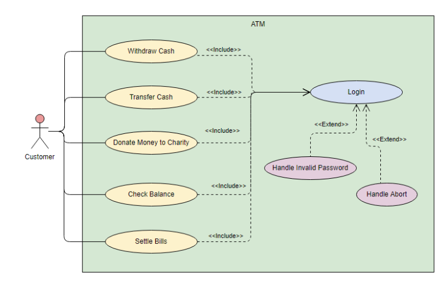

# 소프트웨어 설계

## 미들웨어
***대용량 데이터를 처리하는 과정에서 하나의 컴퓨팅 환경에서만 처리하기에는 어려워졌고 성능개선과 장애요소 최소화를 위해 분산 시스템 환경이 필요해졌다.***
+ 애플리케이션이 서로 데이터 교환이 가능하게 하는 소프트웨어
+ 여러 운영체제에서 응용 프로그램들 사이에 위치한 소프트웨어이다.
+ 📌 사용자가 정보 교환 방법 등의 내부 동작을 알 필요 없이 표준화된 인터페이스를 사용하여 데이터 교환
  + RPC Remote Procedure Call 기반 미들웨어
  + MOM Message-Oriented Middleware 메시지 지향 미들웨어
### 메시지 지향 미들웨어, Message-Oriented Middleware, MOM
+ 📌 느리고 안정적 응답보다는 즉각적인 응답이 필요한 온라인 업무에 적합하다.
+ 독립적인 애플리케이션을 하나의 통합된 시스템으로 묶기 위한 역할을 한다.
+ 📌 상이한 애플리케이션 간 통신을 비동기 방식으로 지원한다.
+ Message Queue 기반 패턴이 주 + 브로드캐스트 형식 / 멀티 캐스트 형식
+ 메세지를 전달하는 과정에서 보관 또는 라우팅 및 변환이 가능하다.
  + 라우팅이 가능하다는 것은 미들웨어 수준에서 여러 사용자에게 메세지를 배포할 수 있다는 의미이다. 멀티 캐스트가 가능해진다.
+ 비동기이므로 데이터 불일치가 발생할 수 있고, 메시지 에이전트를 필요로 한다는 점에서 관리나 비용이 더 들어간다.

  
## 소프트웨어 설계
### 요구사항 분석
+ 소프트웨어 개발을 출발점이면서 실질적인 첫 번째 단계이다.
+ 소프트웨어가 무엇을 해야 하는가를 추적하여 요구사항 명세를 작성하는 작업
#### 기능적 요구사항
+ 단순히 어떤 기능들이 있어야 한다~
#### 비기능적 요구사항
+ 📌 성능, 신뢰성, 보안성, 안전성, 가용성(사용자가 원하는 순간에 서비스를 제공하는지)
### 분석분야
> 요구추출, 도메인 분석, 모델링, 프로타이핑과 시험, 문서화 및 검토
+ 도메인 분석(Domain Analysis)
  + 요구에 대한 정보를 수집하고 배경을 분석하여 이를 토대로 모델링을 하게 된다.
### 설계원리
#### 추상화 기법
> 📌 자료(데이터) 추상화, 제어 추상화, 과정 추상화
+ 📌 AVL 다이어그램은 존재하지 않고, AVL 알고리즘이 있다.
  + 자가 균형 이진 탐색 트리
  + 편향 트리를 AVL 트리로 재구성해 이진 탐색 트리 속성을 가진다.
  + 왼쪽, 오른쪽 서브 트리 높이 차이가 1이다.

  
## 요구사항 분석 다이어그램
> Data Flow Diagram, UML Diagram, E-R Diagram

  
## UML 다이어그램, Unified Modeling Language
+ 기능적(유스케이스 다이어그램)
+ 정적(클래스 다이어그램)
  + Operation: 클래스의 동작
+ 동적(상태, 순서 다이어그램)
### 유스케이스 다이어그램

+ 시스템, 액터, 유스케이스, 관계
  + 📌 시스템과 상호작용하는 외부 시스템도 '액터'다.
  + 구성요소 간 관계: 연관, 확장, 📌 일반화, 의존
### 순차 다이어그램(시퀀스 다이어그램)
+ 객체 간 동적 상호작용을 시간 개념을 중심으로 모델링 하는 것이다.
+ 일반적으로 다이어그램의 수직 방향이 시간의 흐름을 나타낸다.
+ 엑터, 객체, 메시지, 회귀 메시지, 📌 제어블록(제어문을 위한 루프)

  
## 소프트웨어 개발 방법론
> 구조적, 정보공학, 객체지향, 컴포넌트 기반 방법론
+ 소프트웨어 모델링
  + 📌 모델링 작업의 결과물은 다른 모델링 작업에 영향을 줄 수 있다.
  + 소프트웨어 모델을 사용할 경우 개발될 소프트웨어에 대한 이해도 및 이해 당사자 간의 의사소통 향상에 도움이 된다.
  + 모델(Model)
    + 모델은 개발 대상을 추상화하고 기호나 그림 등으로 시각적으로 표현한다.
    + 모델을 통해 소프트웨어에 대한 이해도를 향상시킬 수 있다.
    + 모델을 통해 이해 당사자 간의 의사소통이 향상된다.
    + 모델을 통해 향후 개발될 시스템의 유추는 가능하다. - 프로토타입 모델
### 1. 구조적 방법론(폭포수)
> DFD(Data Flow Diagram), DD(Data Dictionary)
+ 전체 시스템을 기능에 따라 나눠 개발하고 이를 통합하는 분할과 정복 접근 방식의 방법론
#### 자료흐름도(DFD)
+ 요구사항 분석에서 자료의 흐름 및 변환과정과 기능을 도형 중심으로 기술하는 방법
+ 자료 흐름 그래프, 버블차트라고도 함
+ 자료 흐름도 구성요소
  + 프로세스(Process) - 동그라미
  + 자료 흐름(Flow) - 화살표
  + 📌 자료 저장소(Data Store) - 평행선
  + 📌 단말(Terminator) - 사각형
### 2. 정보공학 방법론(프로토타입)
+ 데이터베이스 설계의 표현의 모델링 언어 'Entity-Relationship Diagram', E-R 다이어그램
### 3. 객체지향 방법론(반복적 개발), OOA(Object Oriented Analysis)
> OOSE(Jcobson), OMT(📌 Rumbaugh), OOD(Booth) 
+ 객체라는 기본 단위로 시스템을 분석, 설계
+ 📌 상향식 프로세스를 사용
#### UML 표기법
+ UML 다이어그램
  + 통합 모델링 언어를 사용하여 시스템 상호작용, 업무흐름, 시스템 구조, 컴포넌스 관계 등을 그린 도면
  + 📌 정적모델: 클래스, 컴포넌트, 패키지, 개발
  + 📌 동적모델: 시퀀스, 콜라보, 상태, 상호작용, 타이밍
  + 📌 기능모델: 유스케이스, 액티비티
#### Booth Method
+ 미시적 개발 프로세스, 거시적 개발 프로세스로 접근하는 방법
+ 각 작업에 대한 다이어그램, 클래스 계층의 정의, 클래스들의 클러스터링 작업 수행
#### Jcobson Method
+ Use Case를 사용하여 분석
+ 사용자, 외부 시스템, 다른 요소들이 시스템과 상호작용하는 방법을 기술
#### Wirfs-Block Method
+ 분석과 설계 간 구분이 없으며, 고객 명세서를 평가하여 설계 작업까지 연속적으로 수행
#### Rumbaugh Method
+ 📌 객체 모형, 동적 모형(상태도), 기능 모형(자료 흐름도)의 3개 모형을 생성
##### 📌 자료흐름도는 객체지향 방법론의 OMT(Rumbaugh)와 구조적 방법론 두 곳 모두에 나온다.
### 4. 컴포넌트 기반 방법론
> RUP, XP, Agile, 마르미
+ 컴포넌트
  + 명백한 역할을 가지고 독립적으로 존재할 수 있는 시스템의 부분으로 넓은 의미에서는 재사용되는 모든 단위라고 볼 수 있으며, 인터페이스를 통해서만 접근할 수 있는 것
#### 익스트림 프로그래밍, eXtreme Programming, XP
+ 애자일 개발 프로세스의 대표적인 방법
+ 계속 변경되는 비즈니스 상의 요구가 있는 경우 적합한 방법이다.
#### 스크럼
+ 애자일 방법의 하나
+ 프로젝트 개발 기간을 잘게 쪼개서 전력 개발하는 방법
  + 스크럼 마스터: 스크럼 팀이 스크럼을 잘 수행할 수 있도록 객관적인 시각에서 조언을 해주는 가이드 역할을 수행
  + 스프린트(Sprint): 일정량의 작업을 완료하는 시간이 정해진 짧은 기간
  + 제품 백로그(Product Backlog): 스크럼 팀이 해결해야 하는 목록으로 소프트웨어 요구사항, 아키텍처 정의 등이 포함될 수 있다.
  + 속도(Velocity): 한 번의 스프린트에서 한 팀이 어느 정도의 제품 백로그를 감당할 수 있는지에 대한 추정치로 볼 수 있다.

  
## 오버로딩 vs 오버라이딩
***둘 다 객체지향 개념에서 다형성을 지원하는 기법이다.***
### 오버로딩
+ 📌 같은 이름의 메서드에서 매개변수의 유형과 개수가 다르도록 하는 다형성 지원 기법
### 오버라이딩
+ 📌 상위 클래스에서 정의한 일반 메소드의 구현을 하위 클래스에서 무시하고 재정의할 수 있다.

  
## 소프트웨어 개발영역을 결정하는 요소
### 인터페이스
+ 소프트웨어에 의해 간접적으로 제어되는 장치와 소프트웨어를 실행하는 하드웨어
+ 기존의 소프트웨어와 새로운 소프트웨어를 연결하는 소프트웨어
+ 순서적 연산에 의해 소프트웨어를 실행하는 절차
#### 기능, 성능, 제약조건 등

  
## UI
+ Feedback
  + 시스템의 상태와 사용자의 지시에 대한 효과를 보여주어 사용자가 명령에 대한 진행 상황과 표시된 내용을 해석할 수 있도록 도와주는 것
### UI 설계도구
+ 와이어프레임
  + 기획 단계의 초기에 제작하는 것으로, 페이지에 대한 개략적인 레이아웃이나 UI 요소 등에 대한 뼈대를 설계하는 단계.
+ 목업(Mockup)
  + 📌 디자인, 사용방법설명, 평가 등을 위해 실제 화면과 유사하게 만든 정적인 형태의 모형
  + 시각적으로만 구성 요소를 배치하는 것으로 일반적으로 실제로 구현되지는 않음
+ 스토리보드
  + 와이어프레임에 콘텐츠에 대한 설명, 페이지 간 이동 흐름 등을 추가한 문서
### 종류
> GUK(Graphical User Interface), OUI(Organic User Interface), NUI(Natural User Interface), CLK(Command Line Interface)
+ NUI(Natural User Interface): 사용자의 자연스러운 움직임을 인식

  
## 디자인 패턴
***소프트웨어 설계에서 자주 발생하는 문제에 대한 일반적이고 반복적인 해결 방법***
### GoF(Gang of Four) 디자인 패턴
+ 생성 패턴
  + 📌 Abstract Factory, Builder, Prototype, Singleton
+ 구조 패턴
  + 📌 Adapter, Bridge, Proxy, Composite, Decorator, Facade, Flyweight
+ 행동 패턴
  + 📌 Chain of Responsibility, Command, Iterator, Mediator, Observer, State, Strategy, Visitor
    + Strategy 패턴: 알고리즘 선택하는 행위패턴

  
## 캡슐화, Encapsulation
+ 속성과 관련된 연산을 클래스 안에 묶에서 하나로 취급하는 것을 의미하는 객체지향 개념

  
## 소프트웨어 아키텍처
### 설계과정
+ 설계 목표 설정
+ 시스템 타입 설정
+ 스타일 적용 및 커스터마이즈
+ 서브시스템의 기능, 인터페이스 동작 작성
+ 아키텍처 설계 검토
### 소프트웨어 아키텍처 모델
#### MVC, Model-View-Controller
+ 뷰마다 모델이 필요하진 않다.
+ 📌 사용자 인터페이스를 담당하는 계층의 응집도를 높일 수 있고, 여러 개의 다른 UI를 만들어 그 사이에 결합도를 낮출 수 있다.
#### 파이프 필터 아키텍처
+ 데이터 스트림을 생성하고 처리하는 시스템에서 사용
+ 📌 필터 간 데이터 이동 시 데이터 변환으로 인한 오버헤드가 발생한다.

  
## 클래스 설계원칙
### 단일 책임원칙
+ 클래스를 변경해야 하는 이유는 단 하나여야 한다.
### 개방-폐쇄 원칙
+ 클래스는 확장(상속)에 대해 열려 있어야 하며 변경에 대해 닫혀 있어야 한다.
### 리스코프 교체의 원칙(LSP: Liskov Substitution Principle)
+ 📌 기반 클래스는 파생 클래스로 대체할 수 있어야 한다.
+ 파생 클래스는 언제나 자신의 기반 클래스를 교체할 수 있다
+ 파생 클래스(신버전)에서 기반 클래스의 모든 메서드(구버전)를 지원하지 않으면 상속의 기본인 IS-A 관계가 성립이 안 되기 때문이다. 
+ 리스코프 교체의 원칙을 지켜 설계해야 올바른 IS-A 관계를 기반으로 안정적인 다형성을 유지할 수 있다.
### 의존관계 역전의 원칙
+ 📌 클라이언트는 구체 클래스가 아닌 추상 클래스(인터페이스)에 의존해야 한다.

  
## 기타 용어정리
### 전처리기(FEP, Front End Processor)
+ 📌 입력되는 데이터를 컴퓨터의 프로세서가 처리하기 전에 미리 처리하여 프로세서가 처리하는 시간을 줄여주는 프로그램이나 하드웨어
+ 호스트 컴퓨터와 단말기 사이에서 전송처리를 먼저 수행함으로써 컴퓨터의 부하를 줄여주는 역할
+ 패킷을 분할, 분할한 패킷의 조립, 메세지 검사 등을 처리
### EAI(Enterprise Application Integration)
+ 기업 애플리케이션의 통합
+ 데이터를 교환하고 제공하는 서비스를 호출하여 기업 내 어플리케이션 사이의 통신을 제공하는 프로세스
+ 기업 내 다양한 애플리케이션이 서로 상호작용하기 쉽게 도와주는 솔루션
### GPL, 일반 공중 사용 허가서(GNU General Public License, GNU GPL 또는 GPL)
+ 자유 소프트웨어 재단에서 만든 자유 소프트웨어 라이선스로, 소프트웨어의 실행, 연구, 공유, 수정의 자유를 최종 사용자에게 보장
### Duplexing
+ 이중통신(duplex) 또는 쌍방향 통신은 두 지점 사이에서 정보를 주고 받는 전자 통신 시스템

2 2 4 2 3 // 2 1 2 1 1 // 1 3 4 2 4 // 1 2 2 4 3
1 2 4 2 3 // 2 2 2 1 4 // 1 3 4 2 4 // 1 2 2 4 4

